# Moodsic -- Find a new playlist with just one photo!

#### WDI Seattle Project 3

## Project Management Tools
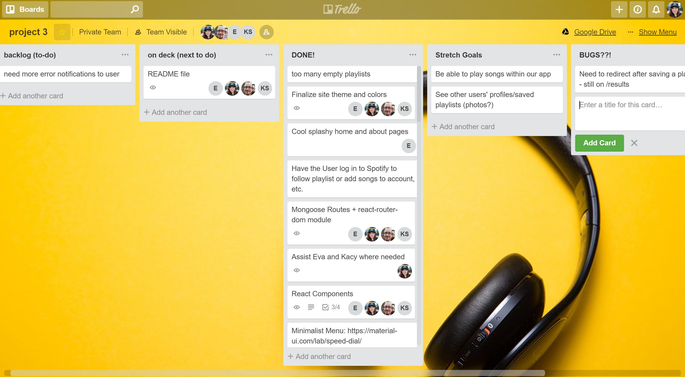

##### Slack
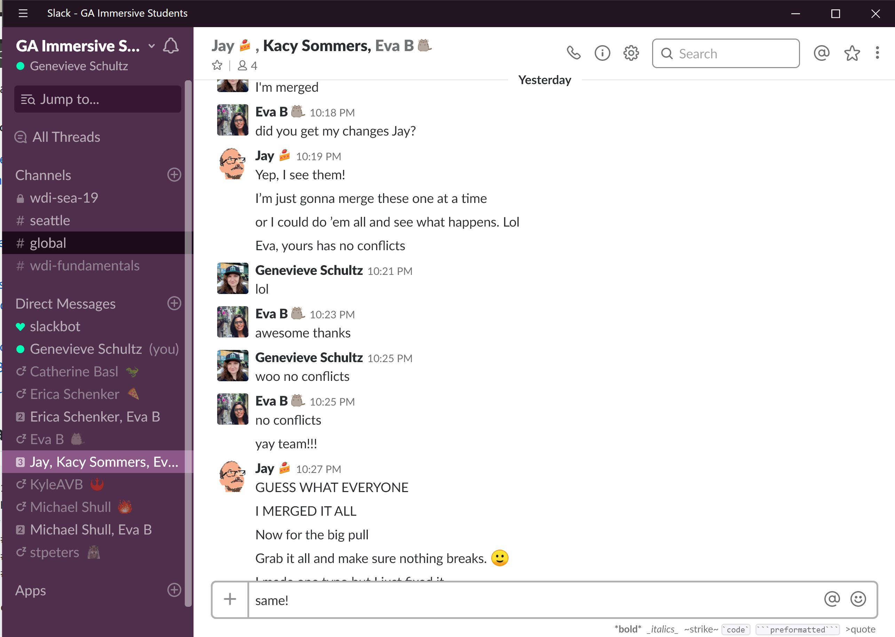

## Project Description

Moodsic allows you to create personalized playlist based on your mood, by uploading a photo to your profile.

[Check it out for yourself!](heroku link)

### Developers:
###### Jay Hathaway - Spotify API and Backend
###### Kacy Sommers - Full-Stack and Logics
###### Genevieve Schultz - Project Manager, Design, Full-Stack
###### Eva Barrett - Design, Front-End, Cloudinary API

About the App

How to use Moodsic:
Start by clicking “Sign Up” on the homepage and creating a user profile.




User Stories:
- Sam has a busy work and personal life and enjoys all types of music. Since he is always on the go he needs a way to be able to open an app and get a list of songs playing without any time wasted. With his love for all genres of music, Moodsic will allow him to quickly select his generated playlist and get back to what he’s doing.

- Derrick likes to call himself a musician and enjoys inspiration. One way he gets his ideas is to listen to new artists. Not knowing what all is out there with Moodsic he will be able to get random categorized playlists for him to enjoy. He is able to select the genre to make it more customized for what type of music he is in the mood for.
- Megan likes social media and the latest apps that allow her to express herself and enjoy life. She likes to upload photos of her daily adventures. With Moodsic she will not only get to upload her favorite photos but have some music to go along with what she is doing. The app will allow her to share with friends and stay connected.

#### Under the Hood

##### Key Technologies Used:
- React
- React Router
- MongoDB
- Mongoose
- Axios
- Node Express
- Material UI
- Chart.JS
- Spotify API
- Cloudinary API
- JWT and bcrypt

##### Additional Node Modules:
 - React-Dropzone
 - React-Responsive-Modal

## Project Timeline

##### Planning
- Shared app Ideas
- Researched usable APIs
- finalized out selection to Spotify and Cloudinary API
- agreed to use Trello Board
- agreed to use wire framing (Adobe XD)

## Wire Frames
#### Genevieve created wire frames in Adobe XD
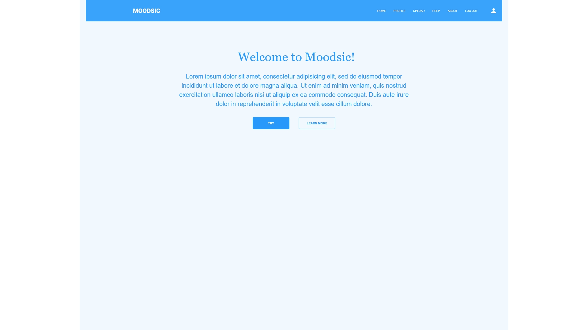
#
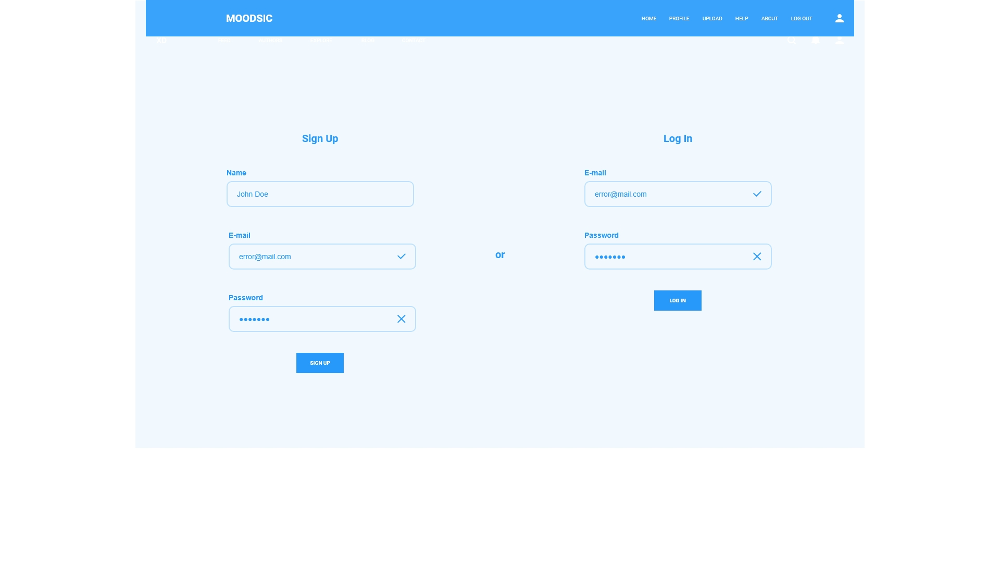

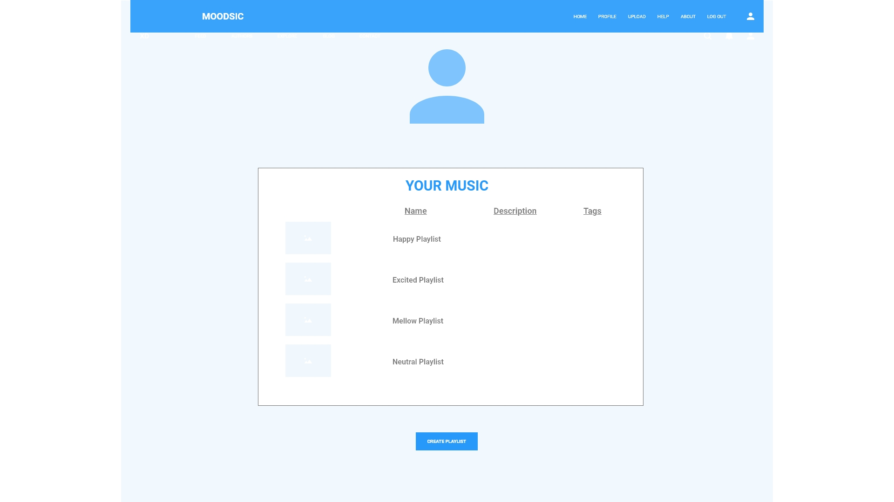

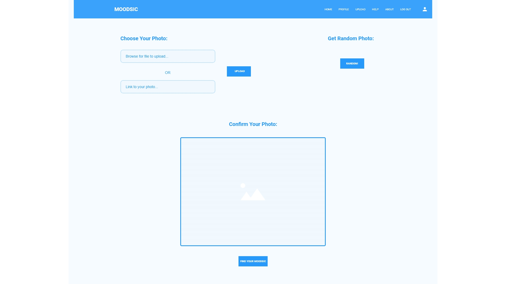

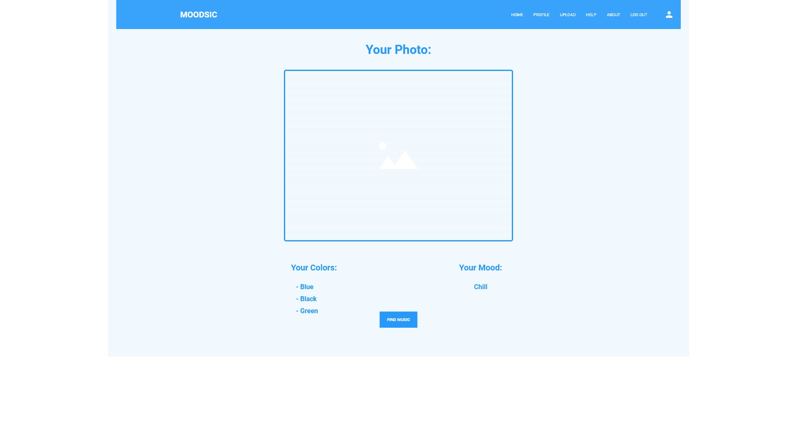

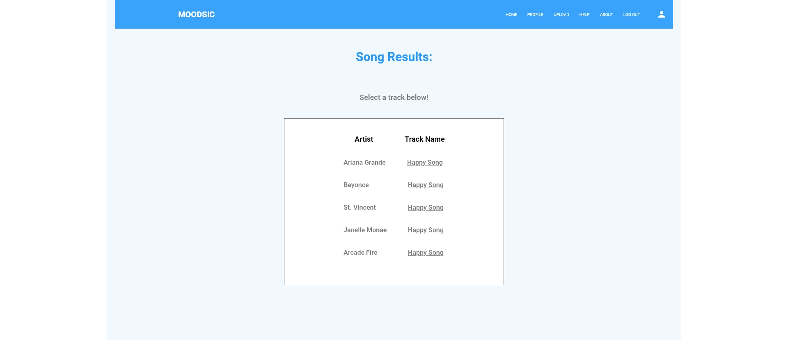

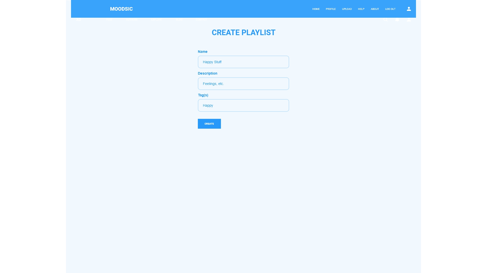

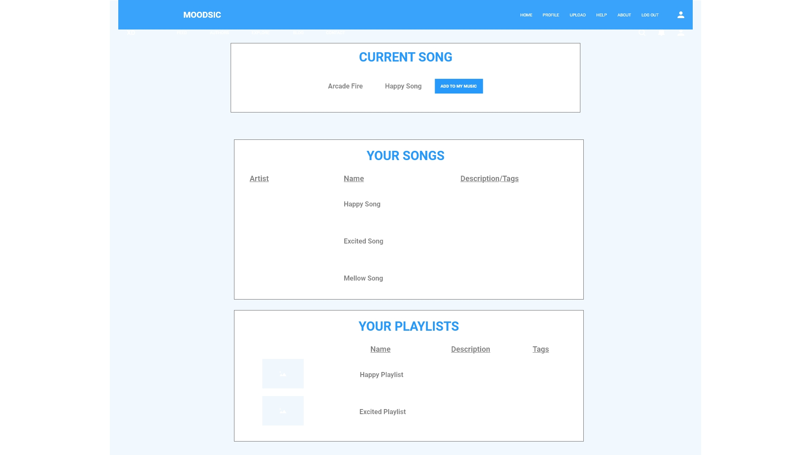

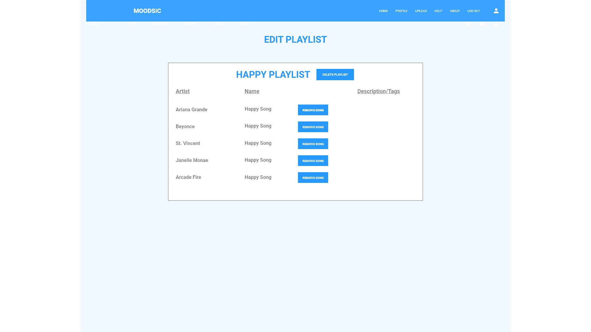

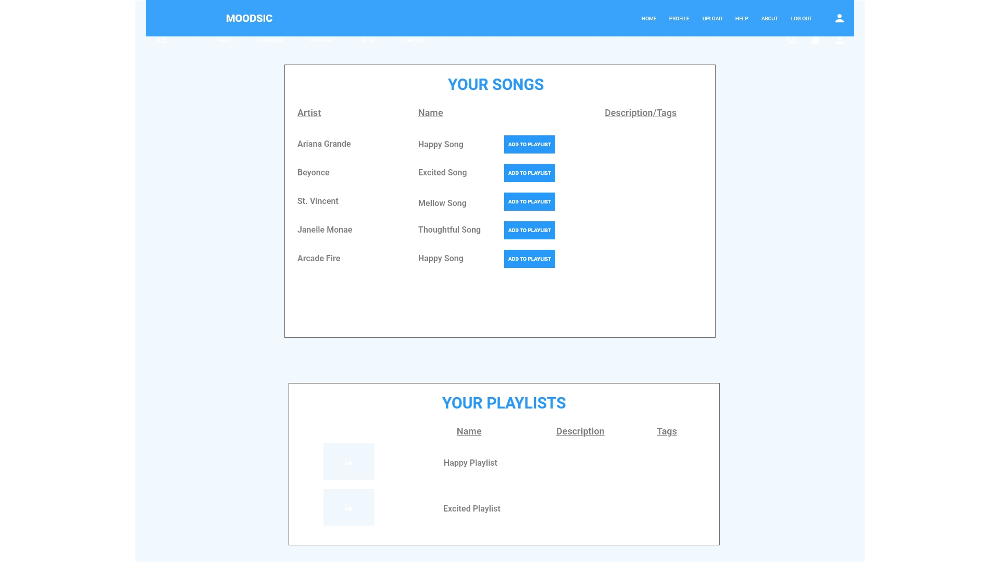

##### Organization
- We used a trello board to keep track of tasks.
- We used slack a lot to communicate and send alerts for merging, etc.

##### Building Phase Summary
Jay put a lot of work into getting the Spotify API hooked up to our boilerplate site. He was also able to add on extra features related to Spotify later in our building phase.
Kacy created logic for taking the colors from the cloudinary API and generating "moods" that would correspond to songs pulled from Spotify.
Eva got the Cloudinary API connected with an upload box component.
Genevieve helped with a little bit of everything, especially when it came to writing the React components to tie everything together.

##### Authenticating With Spotify

Spotify’s oAuth process looked daunting at first—the site uses three different authorization flows, and we needed two of them for our app.

First, we needed client-level authorization so anyone could see a playlist when they uploaded a photo. That was the easy part: we send Spotify our app’s key and secret (which has to be sent on the back end for security reasons, and it has to be a key:value pair converted to base64 for reasons that aren’t entirely clear!), and Spotify sends back a token we can use to make API requests. We jumped through these hoops pretty quickly.

Spotify’s recommendation engine takes the values we give it for music features like valence(‘happiness’), danceability, and mode(major or minor key), and returns a list of songs. We can render this on the page and show it to the user—they never have to sign into their Spotify account.

But when the user wants to SAVE a playlist to Spotify, that requires a second authorization flow. To make this work, we had to set up a separate server that handles a redirect to Spotify’s user login page. Once the user logs in, a callback route on the server sends us an access key, which we store in a cookie.

The biggest problem with this is that we were building a React app—redirecting to Spotify and then having Spotify redirect back to the root of our app was going to cause a headache for the user. We tried a lot of different ways of saving the state they were in before they authenticated, so we could send them right back to their playlist page—none of them worked, because the redirect would cause the page to refresh, wiping out our app’s state and starting from scratch. 

Instead, we decided to open the Spotify login page in a different window. That’s fine, except that our server doesn’t have any way to run client-side code to close a browser window. To solve that, we had the server send back an HTML file with a script tag and one line of code: window.close(). It’s hilarious, but it solves the problem.

##### Testing/Debugging:
- We tested and debugged throughout the whole process
- Had a bugs section on our trello board so items could be added there

## Routes

## auth routes
| Method | Path						|
| -------| ------------------------ | 
| POST 	 | /auth/me/from/token 		|
| POST 	 | /auth/login				|
| GET 	 | /auth/logout				|
| GET 	 | /auth/get/spotify/token	|

## playlist routes
| Method | Path						|
| -------| ------------------------	|
| POST 	 | /playlist				|
| GET 	 | /playlist/user/:userId	|
| PUT 	 | /playlist/:id			|
| DELETE | /playlist/:id			|

## Next Steps and Future Improvements

This project would be very useful as a mobile app, and still has a long way to go in that regard. Ideally it could become something of an instagram and spotify hybrid, accessing the users camera through, playing the music without leaving it, and allowing users to follow each other and have a feed. Along with these mobile improvements, we hope to be able to continue enhancing the color to mood logic as well.

###### Kacy's Section

###### Acknowledgements: 

Thanks to David and MPJ from the DevTips YouTube Channel for their great explanation of Spotify oAuth and their server template code. Thanks also to Bilal Budhani of CodeInfuse for his tutorial on uploading to Cloudinary with react-dropzone. 

